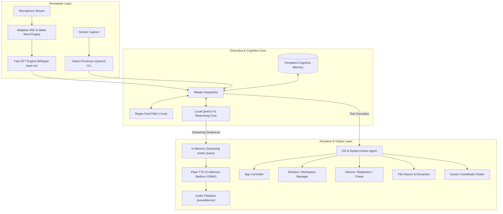

# AGENTS ARCHITECTURE & SYSTEM PRIORITIES
**Project:** Offline Autonomous Voice & Multimodal AI System  
**Core Model:** Local Qwen (`qwen/qwen3-vl-4b`) running on LM Studio (NVIDIA GPU accelerated)  
**Host Environment:** Windows 11 Offline Workstation  

---

## 1. Executive Summary & Vision

The objective of this project is to build a fully autonomous, ultra-responsive, offline AI assistant operating with deep system-level authority, real-time screen awareness, and fluid voice interaction.

The entire intelligence layer runs 100% locally and privately, driven by the **Qwen Vision-Language model (`qwen/qwen3-vl-4b`)** hosted via LM Studio's local inference server.

---

## 2. Core Priority Hierarchy

### **PRIORITY #1: EXTREME SPEED & ZERO-LATENCY EXECUTION (The Absolute Constraint)**
*Speed is the barrier between a clunky voice tool and a fluid AI assistant.* If the system takes 4 to 8 seconds to respond, conversational flow is destroyed. Every millisecond of latency is treated as a critical bug.

- **Target Response Latency:** Sub-second (< 800ms) perceived Time-To-First-Audio from the instant the user stops speaking.
- **Rule of Zero Disk I/O:** Audio streams, STT transcriptions, and TTS synthesis MUST never hit the hard drive during interactive turns. Everything must stay resident in RAM.
- **Rule of Zero Process Spawns:** Never spawn Python interpreters (`python -m piper`, CLI calls) during interaction. All models and TTS engines must remain resident in memory.
- **Rule of Pipelined Streaming:** Text generation and speech synthesis must run concurrently. Never wait for the complete LLM text generation before speaking sentence one.

---

### **PRIORITY #2: MULTIMODAL REAL-TIME VISION**
The assistant is visually grounded. It must understand what is happening on the user's screen in real time without lag:
- Direct multimodal queries ("What is this error?", "Summarize this chart", "What code is currently open?").
- Dynamic coordinate grounding for automated screen actions and UI control.
- Efficient visual downscaling and in-memory base64 JPEG encoding to preserve GPU VRAM and keep inference fast.

---

### **PRIORITY #3: AUTONOMOUS ACTION ENGINE & OS CONTROL**
The assistant is not a passive chatbot; it is an active operator of the operating system:
- **Instant App Lifecycle:** Launch, focus, arrange, and terminate any Windows application.
- **Media & Hardware Automation:** Control volume, brightness, monitors, lock screen, sleep state, audio output endpoints.
- **File System Intelligence:** Fast search, inspection, and extraction of contents across local folders (Downloads, Documents, Desktop).
- **Process & Automation Bridges:** Execute PowerShell, run commands, interact with third-party tools (BlockLock, Dev environments, browser sessions).

---

### **PRIORITY #4: PERSISTENT COGNITIVE MEMORY & USER PERSONALIZATION**
The assistant maintains persistent context across interactions:
- **Zero-Latency Context Injection:** Compact, pre-computed user profile and explicit facts injected into system prompt without blowing context limits.
- **Asynchronous Background Consolidation:** Memory updates, summarization, and changelog writes must execute in background worker threads—NEVER blocking voice interaction.
- **Adaptive Persona:** Direct, snappy, concise, conversational tone with zero filler phrases ("Certainly!", "As an AI...").

---

### **PRIORITY #5: SEAMLESS DUPLEX INTERACTION & BIOMETRIC SECURITY**
- **Continuous Conversational Flow:** Multi-turn follow-ups without requiring wake word repetition on every sentence.
- **Speaker Verification:** Instant speaker verification against enrolled voiceprints to safeguard system control commands without stalling the conversational loop.
- **Barge-In / Interruption Handling:** Immediate audio termination when the user speaks while the assistant is talking.

---

## 3. Bottleneck Analysis & Latency Elimination Matrix

The baseline prototype suffered from multiple architectural bottlenecks totaling **5,000ms – 9,000ms** of latency per turn. Here is the exact roadmap for how each barrier is eliminated:

| Stage | Baseline Bottleneck | Baseline Latency | Optimized Architecture | Target Latency | Speedup |
| :--- | :--- | :--- | :--- | :--- | :--- |
| **1. Wake Word** | Re-instantiating `openwakeword.Model` on every single turn | 500ms – 1,200ms | Persistent resident model in audio stream loop | **< 10ms** | **~100x** |
| **2. Silence VAD** | Hardcoded 1.5-second silence wait limit before cutting audio | 1,500ms | Dynamic adaptive energy VAD + 400ms end-of-speech window | **400ms** | **~3.7x** |
| **3. Audio I/O** | Recording to disk `clip.wav` and reloading with `sf.read` | 150ms – 300ms | Direct in-memory Float32/Int16 PCM numpy buffer | **< 2ms** | **~100x** |
| **4. Speech-to-Text** | Whisper `small` on CPU with unoptimized threading | 2,500ms – 4,000ms | `faster-whisper` `base.en` with multi-core thread affinity & VAD filtering | **250ms – 500ms** | **~6x** |
| **5. Speaker Verify** | Re-reading enrolled WAV and calculating embedding every turn | 1,000ms – 1,800ms | Pre-computed reference embedding in RAM at boot; parallel thread matching | **0ms (parallel)** | **Infinite** |
| **6. LLM Inference** | Blocking `requests.post()` waiting for full output generation | 2,000ms – 3,500ms | **Streaming (`stream=True`)**: First sentence chunk yielded in ~250ms TTFT | **250ms (TTFT)** | **~10x** |
| **7. TTS Generation** | Spawning `python -m piper` subprocess + reading WAV from disk | **4,800ms – 5,500ms** | **In-memory `PiperVoice.load()` with `medium.onnx`** direct to `sounddevice` | **120ms – 180ms** | **~30x** |
| **Total Turn** | Voice speech end to voice playback start | **~7,000ms – 10,000ms** | Pipelined audio stream + streaming TTS | **< 800ms** | **~10x faster** |

---

## 4. Multi-Agent System Architecture

Responsibilities are segregated into specialized asynchronous agents communicating through an in-memory event bus:

### Agent Roles & Specifications:

#### 1. **Executive Orchestrator Agent (`Core-Dispatcher`)**
- **Function:** Central state machine and decision maker.
- **Workflow:**
  1. Receives transcribed user text.
  2. Evaluates fast-path heuristics (<1ms) for high-frequency deterministic actions (media, volume, quick app launch).
  3. Dispatches complex conversational, visual, or multi-step reasoning tasks to the local Qwen model.
  4. Coordinates the streaming response pipeline to ensure speech output begins on sentence one.

#### 2. **Perception & Audio Ingest Agent (`Perception-Core`)**
- **Function:** Real-time audio listener and screen vision provider.
- **Components:**
  - *Wake Word Worker:* OpenWakeWord listener listening for wake triggers without model reloads.
  - *Adaptive VAD:* Voice activity detector monitoring energy and speech silence thresholds (cut-off: 400ms).
  - *Fast STT Worker:* In-memory Whisper model providing accurate transcripts with custom vocabulary biasing.
  - *Vision Worker:* High-speed screen grabber that captures, crops, and optimizes screenshots for local Qwen3-VL ingestion.

#### 3. **Voice Synthesis Agent (`Voice-Synthesizer`)**
- **Function:** Real-time streaming voice generator.
- **Components:**
  - Resident `PiperVoice` instance (`en_US-lessac-medium.onnx`).
  - Sentence buffer: Receives token stream from Qwen, flushes at punctuation (`.`, `?`, `!`, `,`), synthesizes PCM in ~150ms, and queues audio chunks directly into an active `sounddevice.OutputStream`.
  - Barge-in listener: Immediately halts audio playback if user speech begins.

#### 4. **System Actuation Agent (`OS-Actuator`)**
- **Function:** Execution engine for all host OS interactions.
- **Capabilities:**
  - Fast app launching and termination (via Windows APIs and process management).
  - Media key emulation and Windows Core Audio API control.
  - Monitor brightness and power state toggles.
  - Desktop UI element localization and automated cursor interaction.
  - File search across user directories using high-speed indexers.

#### 5. **Cognitive Memory Agent (`Memory-Store`)**
- **Function:** Long-term episodic memory, user profiling, and context retrieval.
- **Design:**
  - Short-term conversational buffer (last $N$ turns).
  - Long-term persistent JSON / SQLite memory store.
  - Asynchronous background consolidation: Analyzes previous turns and updates preferences without blocking active threads.

---

## 5. LM Studio Model Optimization Guide (Qwen3-VL-4B)

To extract maximum performance from the local Qwen model on consumer GPUs (e.g., RTX 3050 6GB):

1. **Dedicated GPU Offload:**
   - Offload 100% of model layers to GPU VRAM.
   - Set context window to `4096` tokens for voice agent mode (avoid large 16k allocations unless doing deep document analysis).
   - Set parallel request slots to `1` in LM Studio to allocate maximum GPU memory bandwidth and compute to the active conversation.

2. **Inference Parameters:**
   - `temperature`: `0.5 - 0.7` for natural, snappy conversation.
   - `max_tokens`: `150 - 300` tokens (spoken responses must be concise).
   - `stream`: `true` (MANDATORY for zero-latency pipelining).

---

## 6. Implementation Roadmap

- [ ] **Phase 1: Speed Foundation (Immediate)**
  - Replace subprocess Piper with resident in-memory `PiperVoice` using `medium.onnx`.
  - Switch STT to in-memory `faster-whisper` (`base.en`) with tuned CPU thread pinning.
  - Implement dynamic VAD silence cut (drop from 1500ms to 400ms).
  - Eliminate all disk writes for temporary audio files.
  - Implement token-to-sentence streaming synthesis pipeline.

- [ ] **Phase 2: Real-Time Multimodal Vision**
  - Streamline vision pipeline to pipe screen capture directly to Qwen3-VL with streaming response.
  - Add active window ROI (Region of Interest) cropping for high-detail focus.
  - Implement visual tool grounding for automated clicking and interface navigation.

- [ ] **Phase 3: OS Autonomy & Action Engine**
  - Implement structured tool-calling / function-calling schema for Qwen3-VL.
  - Unify system control, app control, and media control into an extensible tool registry.
  - Add PowerShell execution sandbox for complex PC automation tasks.

- [ ] **Phase 4: Duplex Conversation & Voice Biometrics**
  - Add hardware echo cancellation / barge-in interruption.
  - Precompute enrolled speaker embeddings to make speaker verification instantaneous.
  - Add proactive contextual notifications and ambient desktop awareness.
